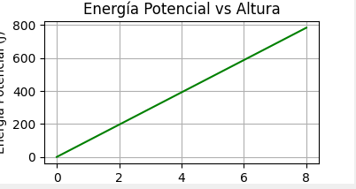

# Mechanical Energy Conservation

This repository contains a Python program that simulates the free fall of an object under the influence of gravity, while calculating and visualizing its kinetic, potential, and total mechanical energy over time. The goal of this simulation is to demonstrate the conservation of energy in a closed system.

## Prerequisites

Before running the code, ensure that you have the necessary libraries installed. You can install the required libraries using `pip`:

```bash
pip install numpy matplotlib
```

## Code Overview

The code simulates the motion of an object falling freely from a height. The following parameters are used for the simulation:

- **Mass (m)**: 1.0 kg
- **Initial velocity (v)**: 0 m/s (starting from rest)
- **Initial height (h)**: 100 meters
- **Total time (t)**: 10 seconds
- **Gravitational acceleration (g)**: 9.8 m/s²

The object’s energy is calculated at each time step as it falls, with the following energy components being tracked:

- **Kinetic Energy (E_k)**: $E_k = \frac{1}{2}mv^2$
- **Potential Energy (E_p)**: $E_p = mgh$
- **Total Mechanical Energy (E_m)**: $E_m = E_k + E_p$

The program uses a simple time-stepping method to update the position, velocity, and energy of the object at each step.

## How to Run the Code

1. Clone the repository or download the Python script.
2. Make sure the `images` folder exists to save the output graphs.
3. Run the script using Python:

```bash
python energy_simulation.py
```

This will generate and save the plots in the `images` folder, including:

- **Energies vs Time**
- **Kinetic Energy vs Velocity**
- **Potential Energy vs Height**

## Results

Once the simulation is run, three graphs will be generated and saved in the `images` folder:

### 1. Kinetic, Potential, and Total Mechanical Energy vs Time


This graph shows the relationship between the kinetic energy (E_k), potential energy (E_p), and total mechanical energy (E_m) over time. As the object falls, the kinetic energy increases, while the potential energy decreases. The total mechanical energy remains constant, demonstrating the conservation of energy.

### 2. Kinetic Energy vs Velocity


In this graph, kinetic energy (E_k) is plotted against the velocity of the object. As the object accelerates due to gravity, its velocity increases, leading to a corresponding increase in kinetic energy. The relationship between kinetic energy and velocity is quadratic, as shown by the formula \( E_k = \frac{1}{2}mv^2 \).

### 3. Potential Energy vs Height



This graph shows how the potential energy (E_p) changes as the height (h) of the object decreases. As the object falls, its height decreases, and so does its potential energy, according to the formula \( E_p = mgh \). This confirms the conversion of potential energy to kinetic energy during free fall.

## Brief Explanation of Results

- The first graph confirms the principle of conservation of mechanical energy, where the total energy remains constant over time, despite the transformation between potential and kinetic energy.
- The second graph demonstrates the expected quadratic relationship between velocity and kinetic energy.
- The third graph shows the expected linear relationship between height and potential energy, which decreases as the object falls.

## Conclusion

This simulation successfully demonstrates the conservation of mechanical energy in a falling object under the influence of gravity. By tracking the kinetic and potential energies, we observe how they transform into each other while maintaining the total mechanical energy of the system. The generated graphs visually confirm these theoretical concepts, making it a useful tool for understanding energy dynamics in physics.

## License

This project is licensed under the MIT License - see the [LICENSE](LICENSE) file for details.
